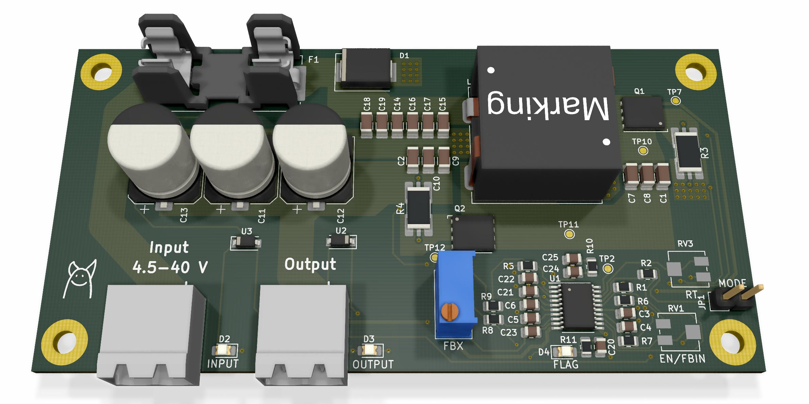
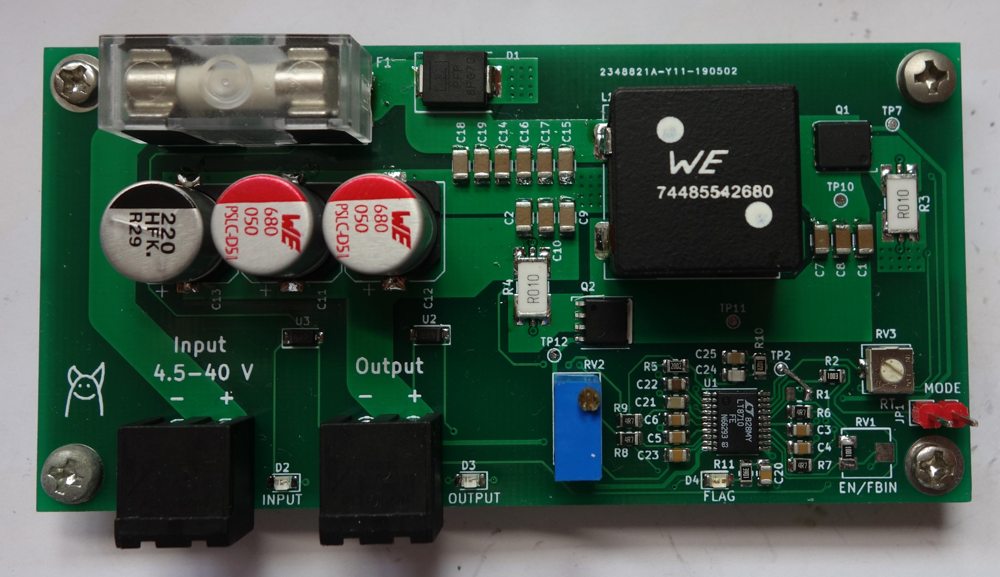

# SEPIC
SEPIC converter design as a school project

Schematic: [kicad/sepic/sepic.pdf](kicad/sepic/sepic.pdf)  
Write-up in czech: [SEPIC_Radovan_Blazek.pdf](SEPIC_Radovan_Blazek.pdf)  
LibreOffice sheet with measured data: [Measurements.ods](Measurements.ods)  
LibreOffice sheet with component values calculations as per LT8710 datasheet: [SEPIC_calculations.ods](SEPIC_calculations.ods)  
LT8710 datasheet: https://www.analog.com/media/en/technical-documentation/data-sheets/8710f.pdf

Bugs in Rev. 1:
- SYNC input of the LT8710 is not pulled to GND

3D render: 

Photo of the finished board: 
